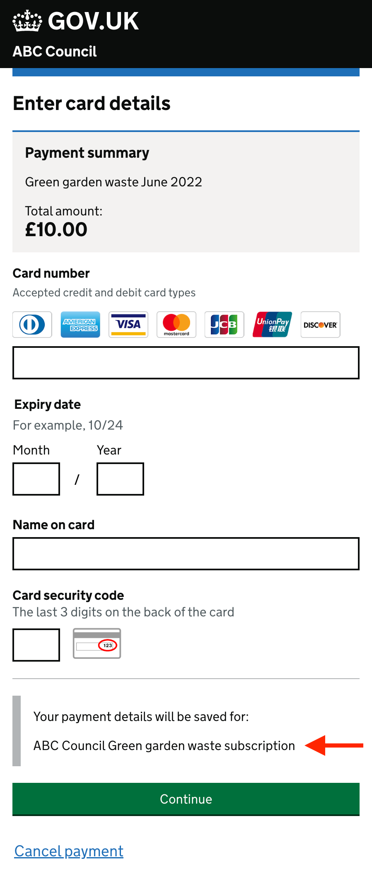
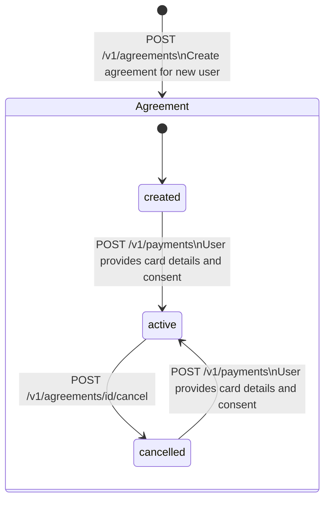

# Agreements

An agreement represents a specific agreement between a paying user and your organisation to charge for a service on a recurring basis.

Once setup, you can use an agreement to take payments from your users card without the user present.

Using the API, you can:
* Create agreements
* Set-up agreements with card details and user consent
* Take recurring payments 

## Creating an agreement

`POST /v1/agreements`

| Body parameter  | | Description |
| ------------- | ------------- | ---- |
| `description`  | Required  | Human readable description of the agreement. This is shown to your user on the payment pages and to your staff on the GOV.UK Pay admin tool. |
| `reference`  | Required | The reference you wish to associate with the agreement. The reference does not need to be unique. |
| `user_reference`  | Optional | The reference for the paying user you wish to associate with the agreement. Multiple agreements can be for the same user reference.| 

### Example request
```json
{
    "reference": "A-SERVICE-REFERENCE",
    "description": "ABC Council Green garden waste subscription",
    "user_identifier": "USER_100"
}
```

### Example response
```json
{
  "id": "cgc1ocvh0pt9fqs0ma67r42l58",
  "reference": "A-SERCVICE-REFERENCE",
  "description": "ABC Council Green garden waste subscription",
  "status": "created",
  "user_identifier": "USER_100",
  "created_date": "2022-07-08T14:33:00.000Z",
  "payment_instrument": null
}
```

The agreement ID will be used to take payments once the user has provided their details. You should save the agreement ID with your user records.

The paying user will need to provide card details and consent to set up the agreement.

### Agreement description

> :warning: This interaction pattern requires further user research and usability testing.

The agreement description you provide will be shown to the paying user when you are [setting up an agreement](#setting-up-an-agreement). 

| | Description |
| --- | --- |
 | A disclaimer showing the agreement description when a payment is being used to setup an agreement.

## Lifecycle

Agreements have a status that represents if they're ready to be used to take payments.


## Setting up an agreement

The simplest way to set up an agreement is to take a one-off payment and instruct the API to save the card details provided for future use by the agreement.

`POST /v1/payments`

| Body parameter  | | Description |
| ------------- | ------------- | ---- |
| `set_up_agreement`  | Optional  | The identifier for the agreement which should be used to save the paying users card details when the payment is successful. |

For a full description of the current payments API see [Creating a payment](https://docs.payments.service.gov.uk/making_payments/#creating-a-payment).

### Example request
```json
{
  "amount": 1000,
  "reference": "SERVICE-PAYMENT-REFERENCE",
  "description": "Green garden waste June 2022",
  "return_url": "https://your.service.gov.uk/completed",
  "set_up_agreement": "cgc1ocvh0pt9fqs0ma67r42l58"
}
```

### Example response
```json
{
  "amount": 1000,
  "description": "Green garden waste June 2022",
  "reference": "SERVICE-PAYMENT-REFERENCE",
  "state": {
    "status": "created",
    "finished": false
  },
  "payment_id": "a01vhg8efe47gfvhkbjh78erl4",
  "payment_provider": "sandbox",
  "created_date": "2022-07-13T11:00:22.334Z",
  "return_url": "https://your.service.gov.uk/completed",
  "agreement_id": "cgc1ocvh0pt9fqs0ma67r42l58",
  "authorisation_mode": "web",
  "_links": {
    "next_url": {
      "href": "https://www.pymnt.uk/secure/61fad953-bf7f-4329-b571-3d00f228e67d",
      "method": "GET"
    }
  }
}
```

## Cancelling an agreement

An active agreement can be cancelled at any time. Once cancelled an agreement cannot be used to take payments.

Cancelled agreements can only be used to take payments if the paying user provides their card details and consent again by [Setting up an agreement](#setting-up-an-agreement).

`POST /v1/agreements/${AGREEMENT_ID}/cancel`

### Example response
```json
{
  "id": "cgc1ocvh0pt9fqs0ma67r42l58",
  "reference": "A-SERCVICE-REFERENCE",
  "description": "ABC Council Green garden waste subscription",
  "status": "cancelled",
  "created_date": "2022-07-08T14:33:00.000Z",
  "payment_instrument": null
}
```

## Get information about a single agreement

`GET /v1/agreements/${AGREEMENT_ID}`

### Example response
```json
{
  "id": "cgc1ocvh0pt9fqs0ma67r42l58",
  "reference": "A-SERCVICE-REFERENCE",
  "description": "ABC Council Green garden waste subscription",
  "status": "created",
  "created_date": "2022-07-08T14:33:00.000Z",
  "payment_instrument": null
}
```

### Example response with user details
```json
{
  "id": "cgc1ocvh0pt9fqs0ma67r42l58",
  "reference": "A-SERCVICE-REFERENCE",
  "description": "ABC Council Green garden waste subscription",
  "status": "active",
  "created_date": "2022-07-08T14:33:00.000Z",
  "payment_instrument": {
    "type": "card",
    "card_details": {
      "card_brand": "Visa",
      "card_type": "debit",
      "last_digits_card_number": "1234",
      "first_digits_card_number": "123456",
      "expiry_date": "04/24",
      "cardholder_name": "Sherlock Holmes",
      "billing_address": {
          "line1": "221 Baker Street",
          "line2": "Flat b",
          "postcode": "NW1 6XE",
          "city": "London",
          "country": "GB"
      }
    }
  }
}
```

## Search agreements

`GET /v1/agreements`

| Query parameter | Description |
| ------------- | ------------- |
| `reference` | The agreement reference, parameter must be a full match. |
| `status` | The agreement status, one 'created', 'active', 'cancelled' |
| `page` | The page of results to return. Defaults to `1`. |
| `display_size` | How many results to return per page. Defaults to `500`. |

### Example response

```json
{
  "total": 100,
  "count": 20,
  "page": 2,
  "results": [
    {
      "id": "cgc1ocvh0pt9fqs0ma67r42l58",
      "agreement_id": "cgc1ocvh0pt9fqs0ma67r42l58",
      "reference": "A-SERCVICE-REFERENCE",
      "description": "ABC Council Green garden waste subscription",
      "status": "created",
      "created_date": "2022-07-08T14:33:00.000Z",
      "payment_instrument": null
    }
  ]
}
```
