# Recurring payment journeys

> :warning: The following are examples of user journeys relating to taking recurring payments. Your service may already include these and some may not be relevant for your service.

## Authenticate a user

Teams must authenticate users at some point during a service that takes recurring payments.

Unlike a one-off payment journey, paying users are agreeing to save their details to be charged in the future.

The paying user may also need to return to:
- update their payment details
- change or cancel the service they’re receiving

| | Description |
| --- | --- |
 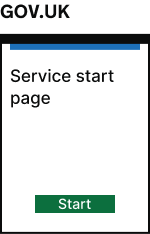 | |
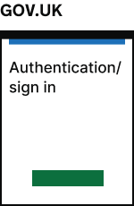 | When the user first signs up and authenticates  with your service, you can [create an agreement](./Agreements.md#creating-an-agreement) to represent that user.

## Set up an agreement and take the first payment

Once the user has registered and been authenticated by your service, you can direct them to make a payment and save their details for future payments.

| | Description |
| --- | --- |
 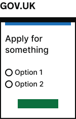 | |
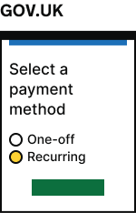 | (Optional) Services may want to give users a choice to select how they want to pay (one-off or recurring payment). |
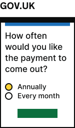 | (Optional) Services may want to give users a choice in how frequently they are charged for the service. |
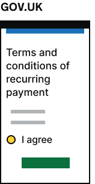 | Serices must ask users to view and agree or decline to the terms and conditions of the recurring charges before making a payment.  The [description you provided for the agreement](./Agreements.md#agreement-description) will also be shown on the payments page. |
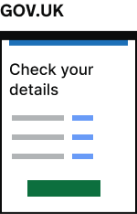 | |
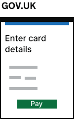 | Take a payment to [set up the agreement](./Agreements.md#setting-up-an-agreement) to be used in future recurring payments. |
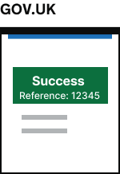 | When the payment is successfully processed, the agreement will be `active` and ready to use by your service.  As well as receiving the paying user back to your service, you can [receive automatic payment event updates using webhooks](../webhooks/README.md#receive-automatic-payment-event-updates-using-webhooks).|
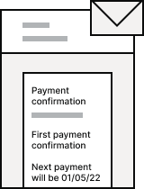 | Services should let users know that the payment has been taken.  If your service is configured for GOV.UK Pay to send receipt emails, these continue to work in the same way. |
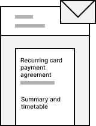 | Services should let users know that they have successfully entered a recurring agreement and when they should expect to be charged again. |

## Take recurring payments

Once an agreement has been setup, you can use it to [take a recurring payment](Payments.md#take-a-recurring-payment).

### Successful payments

You can [create a recurring payment](Payments.md#creating-a-recurring-payment) using the GOV.UK Pay API and providing your users agreement identifier.

When the payment has completed, you can be [notified about the payment events](../webhooks/README.md#receiving-webhook-messages) using webhooks.

| | Description |
| --- | --- |
 | Service must notify users when recurring payments have been successfully taken.   :warning: Note as the user has not provided their email address during a recurring payment, the service will be responsible for sending any payment receipts.

### Failed payments

Recurring card payments can fail for the same reason as one-off card payments. See [Errors caused by payment statuses](https://docs.payments.service.gov.uk/api_reference/#errors-caused-by-payment-statuses).

If a recurring payment fails because the users details are no longer valid, the agreement can be [setup](#set-up-an-agreement-and-take-the-first-payment) with new details.

## Manage recurring payments

The service should:
* Allow users to review the payment schedule they have set up (e.g. when is the next payment due and the schedule of payments after that. You might choose to do this as an email)
* Allow users to access a link to update their payment details without going through the full service journey 
* Allow users a way to stop payments for a service, include an offline and online journey (this may not have been offered before as the service would stop being provided if users stopped paying)